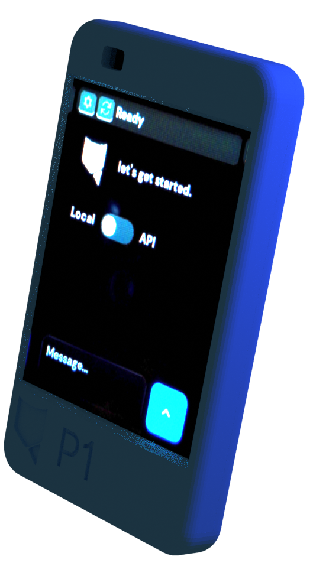
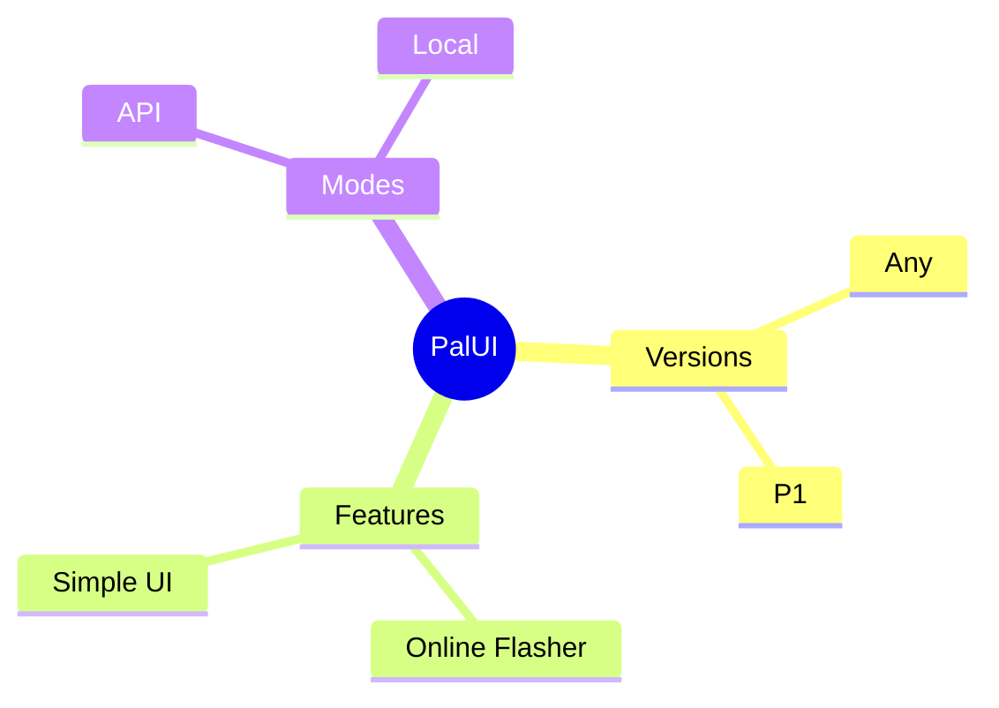

# PalUI

PalUI is a chat interface for Pocketive P1 and ESP32-2432S028 (CYD) devices, which aims to be an agentic launcher for microcontrollers.

# Navigation

-   [Features](#features)
-   [Contents](#contents)
-   [Quickstart](#quickstart)
-   [Training tinyGPT.c-Compatible Models ](#training-tinygpt.c-compatible-models)
-   [UART Inference](#uart-inference)
-   [Future Plans](#future-plans)
-   [Contact](#contact)
-   [Support](#support)

# Features

**Landscape or Portrait:** Supports both modes.

**API or Local:** Switch between popular API providers or Local mode quickly and easily. (**Any** version is *API-only*.)

**Online Flasher:** No need to download anything. You can flash PalUI to your devices on your browser.

**UI Design Analysis:** [Here's a webpage](https://pocketive.tachion.tech/palui) which contains some info about the current 0.8.0 release's design.

-   **Notes**
    -   PalUI is originally developed for [Pocketive P1](https://pocketive.tachion.tech/p1), world's first pocket-sized **local** AI device powered by microcontrollers.
    -   PalUI, GPT.c, tinyGPT.c and Pocketive P1 are developed for educational purposes only, therefore there might be weak points, like in [design](https://github.com/MYusufY/P1), codes and more. I don't claim that it's perfect, since project is under development and not finished. I developed all of them completely by myself, as a 14 years old student :)

-   **Why?**
	- Modern AI chatbots require sending your conversations to remote servers, raising privacy concerns about who has access to your data. Additionally, the massive computing infrastructure needed to run large language models has significant environmental costs. Pocketive P1 explores an alternative approach: running small language models directly on low-power microcontrollers. This enables private, offline AI inference without relying on cloud services or consuming substantial energy. While these models are currently limited compared to their larger counterparts, they demonstrate the potential for edge AI that keeps your data local and your conversations truly private.
	- And, PalUI is kind of like the "frontend" part of the Pocketive P1 project.

# Contents

## Key files in this repository

### P1 Version
- [main.ino](/p1/src/main.ino) -> PalUI P1 itself
- [chat.c](/p1/src/chat.c) -> "Chat section" menu icon
- [api.c](/p1/src/api.c) -> "API section" menu icon
- [wifi.c](/p1/src/wifi.c) -> "WiFi connection section" menu icon
- [dmsans_14.c](/p1/src/dmsans_14.c) -> Font used for PalUI
- [welcome.c](/p1/src/welcome.c) -> Splash screen

### Any Version
- [main.ino](/any/src/main.ino) -> PalUI P1 itself
- [chat.c](/any/src/chat.c) -> "Chat section" menu icon
- [api.c](/any/src/api.c) -> "API section" menu icon
- [wifi.c](/any/src/wifi.c) -> "WiFi connection section" menu icon
- [dmsans_14.c](/any/src/dmsans_14.c) -> Font used for PalUI
- [welcome.c](/any/src/welcome.c) -> Splash screen

# Upload / Flash

If you dont want to make edits/changes in code, you can simply use [PalUI Web Flasher](https://pocketive.tachion.tech/palui/flash) to flash it right in your browser. You dont need to install anything or embed API keys in the code. Unlike my previous LVGL Gemini chat interface project, you enter API keys and connect to WiFi **in** PalUI.

# Compile yourself

This guide will help you to compile PalUI yourself, if you want to make edits/changes in the code.

## Prerequisites

-   PlatformIO Installed
-   ESP32-2432S028 (CYD) module
-   [Preconfigured CYD_LVGL LibPack (by me)](https://github.com/MYusufY/lvgl-gemini/tree/main/arduino_lib)

## Guide

1. **Open your desired version in PlatformIO.** This repo contains two versions:
	-  Any
	- P1
So if you are making a P1 device and want local feature that works with a seperate *ESP32S3* (using [tinyGPT.c](https://github.com/pocketive/tinygpt.c) you can open "p1" folder in PlatformIO in your preferred IDE.
But if you want to try PalUI's **Any** version, you only need a CYD.

2. Specify CYD_LVGL LibPack path in [platformio.ini](https://github.com/pocketive/palui/blob/main/p1/platformio.ini) in `lib_extra_dirs` section.

3. Compile & Upload & Test & Repeat!

## Troubleshooting

Currently, there aren't known bugs or errors in PalUI that happens during compiling. But if you run into any problems or need extra help, you can contact with me.

## Summary Mindmap

# Future Plans

-   [ ] Turning it into a launcher
-   [ ] Turning it into an agentic launcher
-   [ ] Dynamic / Customizable API provider format support
-   [ ] Improve optimization

# Contact

You can contact me using [yusuf@tachion.tech](mailto:yusuf@tachion.tech)

# Support
You can support me using:

